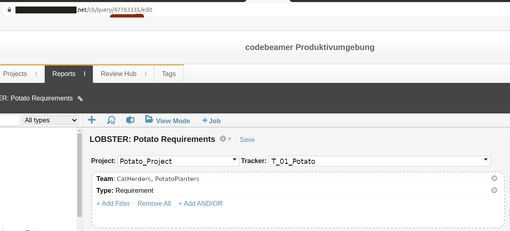

# Tracing to codebeamer requirements

## Limitations

The key limitation is item text, which is currently not
imported. However we do plan to also import item text eventually.

## Setup and requirements

You will need a working codebeamer instance, and your user needs to
have API access.

Create three environment variables:

* `CB_ROOT` URL to point to the root codebeamer instance, this is
  everything up to but excluding the `/cb` part of the url. For
  example if https://codebeamer.com/cb/wiki/117612 is a valid wiki
  page, then you would set `CB_ROOT` to `https://codebeamer.com`.

* `CB_USERNAME` to your username for authenticating with the API

* `CB_PASSWORD` to your (plaintext) password for authenticating with
  the API

These can also be supplied on the command-line, but configuring
environment variables is the recommended approach.

## Use-cases

There are two use-cases supported right now:

* Download all requirements based on a saved codebeamer query (this is
  the normal suggested approach) (using the `--import-query` argument)

* Download only requirements explicitly linked to (using the
  `--import-tagged` argument)

### Importing a query

First create a query and make it accessible to all members of your
team: go to `$CB_ROOT/cb/query` and set up a query that obtains every
item you are interested in and then save it. Make a note of the query
id. For example:



Then invoke the `lobster-codebeamer` tool like so:

```bash
$ lobster-codebeamer --import-query 4776335 --out system-requirements.lobster
```
### Importing only tagged requirements

If you are not interested in a completeness check, or your
requirements are scattered all over the place in codebeamer, you an
alternatively only download specifically tagged items.

For this, first create an lobster trace of some other activity, such
as TRLC:

```bash
$ lobster-trlc path_to_my_requirements --out trlc.lobster
```

We can then feed this lobster file to the `lobster-codebeamer` tool:

```bash
$ lobster-codebeamer --import-tagged trlc.lobster --out system-requirements.lobster
```

Please note that if you do this, then of course you cannot get a
completeness check from `lobster-report`, since by definition this way
you will never see a codebeamer item that isn't somehow tagged
elsewhere.

## Recommendations for CI

If you want to run LOBSTER in the CI, then it is recommended to:

* Not execute `lobster-codebeamer` in CI
* Instead periodically run the tool and check in the `.lobster`
  artefact

There are two reasons for this:

* That way changes in codebeamer do not brick your build.

* In the future when we also import requirement text you can actually
  see what woul have substantially changed in your requirement.
