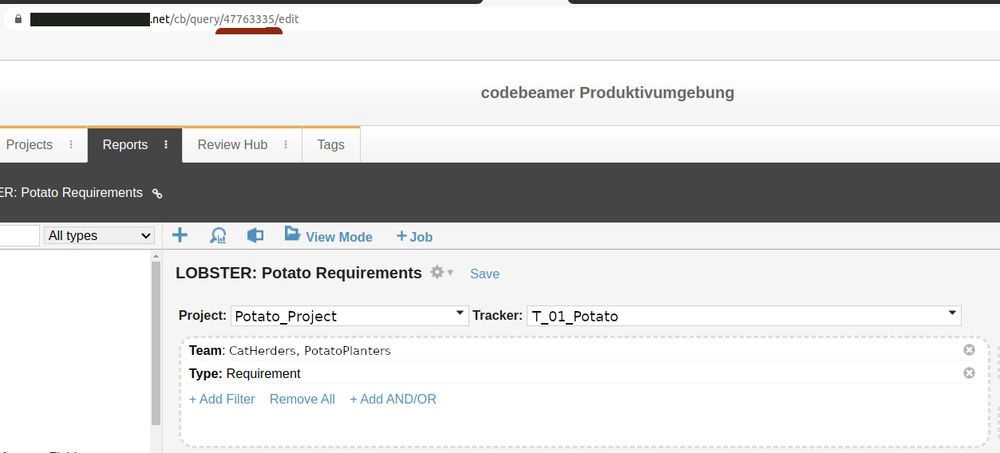

# Tracing to codebeamer requirements

## Limitations

The key limitation is item text, which is currently not
imported. However, we do plan to also import item text eventually.

## Setup and requirements

You will need a working codebeamer instance, and your user needs to
have API access.

Create some environment variables:

* `CB_ROOT` URL to point to the root codebeamer instance. For
  example if https://codebeamer.com/cb/api/v3 is a valid codebeamer URL for 
  accessing API's, then you would set `CB_ROOT` to `https://codebeamer.com/cb`.

  You can also specify this in the config file using `--cb-root`.

You then need to provide authentication. You can do this with two more
envionment variables:

* `CB_USERNAME` to your username for authenticating with the API

* `CB_PASSWORD` to your (plaintext) password for authenticating with
  the API

Or, you can put a section into your `~/.netrc` file.

- Configuring through .netrc is the recommended approach.

* .netrc Configuration for Codebeamer

  ```.netrc
  machine your.codebeamer.url
  login your_username
  password your_password
  ```
Note:
- If value of root in config file is `https://codebeamer.bmwgroup.net`, then value of
  machine in .netrc will be `codebeamer.bmwgroup.net`.

## 🔁 Retry Configuration for HTTPS Requests

You can now configure retry behavior for failed HTTPS requests using the following optional parameters in your YAML configuration file:

### Parameters:

- `retry_error_codes`

  *Type*: `List[int]`

  *Description*: A list of HTTP status codes that should trigger a retry.
  *Example*:
  ```yaml
  retry_error_codes: [502, 503, 504]
  ```

- `num_request_retry`

  *Type*: `int`

  *Description*: Maximum number of retry attempts for each request that fails with a status code listed in `retry_error_codes`.
  *Example*:
  ```yaml
  num_request_retry: 3
  ```

Notes:
- Retries will **only** be attempted if `retry_error_codes` parameter is defined in the config.
- If `num_request_retry` not defined, the default value of 5 will be used.
- This feature enhances reliability when facing temporary connectivity issues, server errors, request timeouts, or threshold limit breaches.

## Generating SSL Certificates

To test with HTTPS using a mock server, you will need to generate a self-signed certificate (`cert.pem`) and private key (`key.pem`).

You can generate them using OpenSSL with the following command:

```bash
openssl req -x509 -newkey rsa:2048 -nodes -keyout key.pem -out cert.pem -days 365
```
When prompted, you can enter values or simply press Enter to skip. This will create:

- cert.pem – the self-signed certificate
- key.pem – the private key

Once generated, place these files under:

- tests_system/lobster_codebeamer/data/ssl/

So that the paths are:

tests_system/lobster_codebeamer/data/ssl/cert.pem

tests_system/lobster_codebeamer/data/ssl/key.pem

These are used by the Flask-based mock server during testing.

## Use-cases

There are two use-cases supported right now:

* Download all requirements based on a saved codebeamer query (this is
  the normal suggested approach) (using the `--import-query` argument)

* Download only requirements explicitly linked to (using the
  `--import-tagged` argument)

### Importing a query

First create a query and make it accessible to all members of your
team: go to `$CB_ROOT/cb/query` and set up a query that obtains every
item you are interested in and then save it. Make a note of the query
id. For example:



Then invoke the `lobster-codebeamer` tool like so:

```bash
$ lobster-codebeamer --import-query 4776335 --out system-requirements.lobster
```
### Importing only tagged requirements

If you are not interested in a completeness check, or your
requirements are scattered all over the place in codebeamer, you an
alternatively only download specifically tagged items.

For this, first create an lobster trace of some other activity, such
as TRLC:

```bash
$ lobster-trlc path_to_my_requirements --out trlc.lobster
```

We can then feed this lobster file to the `lobster-codebeamer` tool:

```bash
$ lobster-codebeamer --import-tagged trlc.lobster --out system-requirements.lobster
```

Please note that if you do this, then of course you cannot get a
completeness check from `lobster-report`, since by definition this way
you will never see a codebeamer item that isn't somehow tagged
elsewhere.

## Recommendations for CI

If you want to run LOBSTER in the CI, then it is recommended to:

* Not execute `lobster-codebeamer` in CI
* Instead periodically run the tool and check in the `.lobster`
  artefact

There are two reasons for this:

* That way changes in codebeamer do not brick your build.

* In the future when we also import requirement text you can actually
  see what woul have substantially changed in your requirement.
