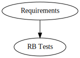
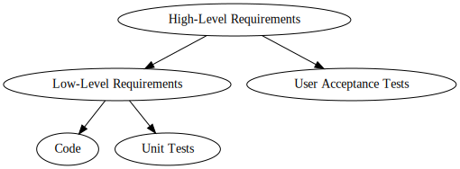

# LOBSTER User's Guide

## Introduction and overview

LOBSTER is a simple but extensible system for demonstrating and
maintaining software traceability. This activity is an essential part
of any safety related software developments, and often involves
duplicate maintenance and tedious manual processes. LOBSTER aims to
simplify this. The basic setup is as follows:

1. Configure LOBSTER via the tracing policy. Usually called `lobster.conf`. More on that [here](https://github.com/bmw-software-engineering/lobster/blob/main/documentation/config_files.md).
2. Annotate traces onto your code, your tests and/or your requirements. Please notice each one of the supported languages has their own way to annotate the tracing tags.
3. Extract the requirement traces with the corresponding lobster conversion tools (e.g. `lobster-cpp`). This converts those traces into a *.lobster file (into a "common unified interchange format").
4. Build report by calling `lobster-report`
5. Render your report by calling the core losbter tools. Usually a local HTML report is desired via `lobster-html-report` or even `lobster-ci-report` for your CI.

The basic idea is that you have a number of artefacts that you wish to
relate to each other; stored in different "databases". Sometimes this
is very literal (e.g. with proprietary requirements tools like
codeBeamer), but often we just mean "somewhere in git".

To show traceability, first we configure LOBSTER with our aims. For
example:

* We want to use LOBSTER in the classic automotive case: we have a
  bunch of tests and we want to just link the tests to the
  requirements; but we don't care at all about the code. In this case
  we configure lobster that there is a requirements level
  "Requirements" and an activity level "RB Tests" and we wish to
  link items of the latter to the former.

  

* We want to use LOBSTER in a more complete way: we have high-level
  requirements that are broken down into low-level requirements; and
  these are both implemented and tested. Separately we perform some
  high-level user-acceptance tests that should be traced to the
  high-level requirements, but not the low-level ones.

  

LOBSTER does not contain any built-in logic, so that you can set it up
the way you want.

Once this configuration step is done, we need to annotate our
requirements / code / activities with tags. This is ususally done
through comments, and differs from language to language. See below for
more detailed descriptions on how to do this. For example in C++ it
looks like this:

```C++
void main()
{
  // lobster-trace: my.requirement
  do_stuff();
}
```

For C++ tests requirements will be referenced inside the documentation.

The syntax for Codebeamer requirements looks like this:

```C++ TEST
/**
 * @requirement CB-#0815 CB-#0816
 */
TEST(RequirementTagTest1, RequirementAsComments) {}
```

A central idea in LOBSTER is to reduce duplication of information, so
tracing links are *only ever added to artefacts lower in the tracing
hierarchy*. So in the first example above, we'd add tags to the tests,
but *not* to the requirements. In the second example above, we'd add
nothing to the top-level requirements; tracing tags *to* the top-level
requirements in the low-level requirements; in code and unit tests we
add tags to the low-level requirements; and finally in integration
tests we add tags to the high-level requirements.

The generated report will show bi-directional traceability, computed
from the uni-directional annotations.

The generated report will also classify the tracing status for each
item, checking:

* Are all required "up-references" set (e.g. is my low-level
  requirement linked to a top-level requirement?)
* Do all up-references point to valid items (e.g. does this thing even
  exist?)
* Are all required "down-references" present (e.g. is there at least
  one piece of code, and at least one test that up-references this
  item?)
* If a version is explicitly mentioned (e.g. codebeamer item 12345 at
  version 42), does this correspond to the latest version in the real
  world?
* Are any other user-defined constraints met (e.g. is the requirement
  status of a codebeamer item "Valid")?

If all of these checks pass, then the item will be accepted, otherwise
error messages will appear. Please refer to this [example
report](example_report.html) which illustrates these ideas.

## Configuring and running LOBSTER

* [Writing configuration files](config_files.md)
* Generating reports (DOCUMENTATION TODO)
* CI integration (DOCUMENTATION TODO)

## Included tools

LOBSTER comes with a small set of default tools to cater to the most
common use-cases. These should be sufficient for most, but it is
always possible to extend LOBSTER to support your own frameworks (such
as integration tests, HIL tests, etc.)

### TRLC (Treat Requirements Like Code)

* lobster_trlc: DOCUMENTATION TODO

Note: We are providing a full traceability report, using LOBSTER itself and [TRLC](https://github.com/bmw-software-engineering/trlc), for each tool maintained in this repository. You are able to produce these reports yourself when using the target `make tracing`.

All its final html outputs are to be seen [here](https://github.com/bmw-software-engineering/lobster?tab=readme-ov-file#requirements-coverage).

### codeBeamer

* [lobster_codebeamer](manual-lobster_codebeamer.md): for tracing to
  codebeamer requirements.

### C++

* lobster_cpp: [lobster_cpp](manual-lobster_cpp.md): for tracing tags in C++
* [lobster_cpptest](manual-lobster_cpptest.md): for tracing requirements and/or defects from C++ tests.
* [lobster_gtest](manual-lobster_gtest.md): for tracing tags in
  (executed) googletests.

> **Note:** The lobster-cpp tool needs a clang-tidy file. Don't forget to generate it to be able to use this conversion tool.

####  Clang-tidy File Generation

You can just run the `clang-tidy` Makefile target in root folder.

If you prefer to do it manually or are Windows user, install Ninja and cmake and then please follow the next steps:

* To generate the clang-tidy file, which is needed for the cpp tool, make sure that your apt is working well on WSL (Windows Subsystem for Linux) or use a Linux environment.

* Clone this repository - `https://github.com/bmw-software-engineering/llvm-project`

* Below 2 dependencies required for clang-tidy creation.
  1. `sudo apt install cmake`
  2. `sudo apt install ninja-build`

* Below 2 commands need to execute to generate the build folder.
  1. `cmake -S llvm -B build -G Ninja -DLLVM_ENABLE_PROJECTS='clang;clang-tools-extra' -DCMAKE_BUILD_TYPE=Release`
  2. `cmake --build build --target clang-tidy`

* Once you generate the build folder you can see the clang-tidy file in `./build/bin` folder.

* To generate the cpp.lobster file, you need to make sure that your llvm-project and lobster-demo project should be in same directory.

### Python

* lobster_python: DOCUMENTATION TODO

### MathWorks SIMULINK / MathWorks MATLAB / GNU Octave

* [MISS_HIT](https://misshit.org) supports the LOBSTER format
  directly. Consult the manual for
  [mh_trace](https://florianschanda.github.io/miss_hit/trace.html) for
  more information.

## Extending LOBSTER

DOCUMENTATION TODO
