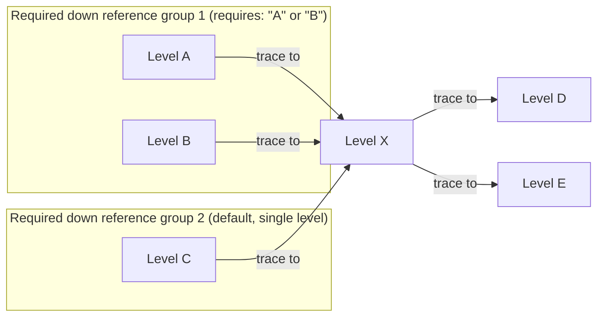

# Illustration: `Required_Down_Reference_Group`

This diagram illustrates the tracing policy graph used by
[`Required_Down_Reference_Group`](definitions.trlc) and
[`Required_Up_Reference`](definitions.trlc).

Level `X` has two required down reference groups:
- Group 1: levels `A` and `B`, combined into one group by a
  `requires: "A" or "B";` declaration (satisfied if either `A` or `B`
  references `X`).
- Group 2: level `C`, which `trace to`s `X` without being combined by any
  `requires` declaration (the default one-group-per-predecessor case).

Both groups must be satisfied for `X`'s down direction to be satisfied.

`X` also has its own `trace to D` and `trace to E` declarations. Even though `X`
declares two up targets, `X`'s required up reference is still a single
requirement: it is satisfied by just one actual reference from an `X` item, to
either `D` or `E` (or, in fact, to any other item at all).

